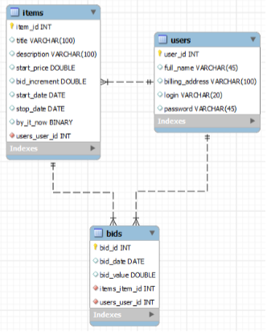





Основы баз данных и SQL
===

Материалы для самоподготовки
---------------------
### Основные материалы - SQL
1. [Презентация Реляционные базы данных](presentations/РБД%20и%20SQL_2018.pptx)
1. [Презентация Проектирование БД](presentations/ПроектированиеБД.pptx)
1. [Презентация Язык SQL](presentations/ОИТ%20=%20Лекция%2007б%20=%20Язык%20SQL.pdf)
1. [Курс на w3schools](https://www.w3schools.com/sql/default.asp){:target="_blank"}
1. [Учебник SQL на русском](http://www.sql-tutorial.ru/){:target="_blank"}
1. [Нормальные формы](https://habrahabr.ru/post/254773/){:target="_blank"}

### Дополнительные материалы - SQL
1. [Документация MySQL](https://dev.mysql.com/doc/refman/5.7/en/sql-statements.html)
1. [Возможности MySQL Workbench](http://mithrandir.ru/professional/soft-and-hardware/mysql-workbench-basics.html)
1. [Работа в MySQL](https://habr.com/ru/post/175985/)

Практическая работа
---------------------
### Первое задание
Вам необходимо выполнить задания на сайте **[sql-ex.ru](http://sql-ex.ru/){:target="_blank"}** из следующих разделов:
  + [Задания по SQL](http://sql-ex.ru/learn_exercises.php){:target="_blank"} - необходимо выполнить **13** первых заданий.
  + [Задания по DML](http://sql-ex.ru/dmlexercises.php){:target="_blank"} - необходимо выполнить **8** первых заданий.

### Второе задание
1. Вам необходимо создать схему БД «Интернет-аукцион» в соответствии со следующей EER-диаграммой:

1. Загрузить схему на сервер (**[MySQL](https://dev.mysql.com/downloads/installer/)**)
1. Заполнить таблицы произвольными данными.
1. Написать запросы в соответствии:
  + Список ставок данного пользователя
  + Список лотов данного пользователя
  + Поиск лотов по подстроке в названии
  + Поиск лотов по подстроке в описании
  + Средняя цена лотов каждого пользователя
  + Максимальный размер имеющихся ставок на каждый лот
  + Список действующих лотов данного пользователя
  + Добавить нового пользователя
  + Добавить новый лот
  + Удалить ставки данного пользователя
  + Удалить лоты данного пользователя
  + Увеличить стартовые цены товаров данного пользователя вдвое
1. Создать дамп базы данных.
1. Прикрепить запросы и дамп к цели в гроу.

Вопросы для самоконтроля
---------------------

