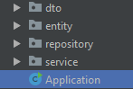
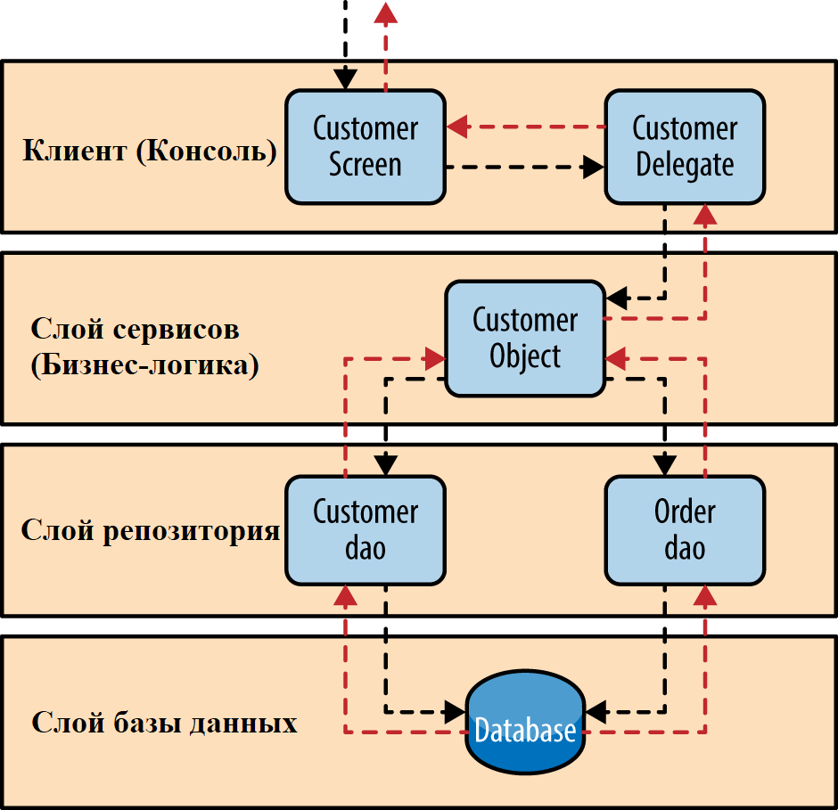





Основы проектирования и дизайна
===

Структура типичных Java-приложений
---------------------

> Данный модуль является чисто теоретическим. Практическое задание в него не включено.
> Как только вы изучите всю теорию и поймете, что можете ответить на вопросы, можете закрывать цель в Grow.

Возможно вы заметили, что приложения прошлых практик имеют схожую структуру. В этом разделе мы попытаемся объяснить, 
почему и для чего это сделано, попутно проанализировав их составные части.

**Любое** приложение работает с какими-либо данными: одни обрабатывают платежи, другие показывают доступные товары в 
интернет-магазине, а третьи выполняют поисковые запросы, составленные пользователем.  
Во всех этих случаях у нас есть **бизнес-домен** - банк, интернет-магазин или поисковая система.

> **Бизнес-домен** - набор объектов и отношений между ними, которые характеризуют какую-либо предметную область из реального 
мира.  
>> **Пример**: Банковская система (упрощенно).  
>> **Сущности**: Пользователь, организация, счет, платеж, депозит, карта.  
>> **Связи**: Пользователь принадлежит организации. У пользователя может быть много счетов. Организация делает платеж другой 
организации. Пользователь открывает депозит. Пользователь заводит карту.

### Entity
Сущности в контексте приложения обычно называются **Entity**.

> **Entity** - сущность из бизнес-домена, представленная в нашей программе как класс, в котором есть только поля, геттеры и 
сеттеры. Никакая логика не должна содержаться в этом классе.

Пример **Entity** - сущность ипотечного займа.  
Она используется при сохранении и получении данных из базы через слой **Repository**. Пример:
<details>

```java
package ru.bank.abc.entity;

/**
 * Ипотечный займ (упрощенный вариант)
 */
public class Mortgage {

    /**
     * Продукт (например Семейная ипотека)
     */
    private Product product;

    /**
     * Размер заемных средств
     */
    private BigDecimal amount;

    /**
     * Размер ипотечной ставки
     */
    private BigDecimal interestRate;

    /**
     * Срок кредитования
     */
    private Integer period;

    /**
     * Список продавцов
     */
    private List<Seller> sellers;

    /**
     * Список заявителей
     */
    private List<Applicant> applicants;

    /**
     * Объект недвижимости
     */
    private Realty realty;

    public Product getProduct() {
        return product;
    }

    public void setProduct(Product product) {
        this.product = product;
    }

    public BigDecimal getAmount() {
        return amount;
    }

    //.... геттеры и сеттеры для полей

    public Realty getRealty() {
        return realty;
    }

    public void setRealty(Realty realty) {
        this.realty = realty;
    }
}
```
</details>
### DTO
Также в приложениях выделяют сущности **DTO** (Data-transfer object). 

> **Data Transfer Object** (DTO) — один из шаблонов проектирования, который используется для передачи данных между подсистемами приложения.

Технически, это то же самое, что и Entity, но с точки зрения бизнес-домена, эти объекты никак не связаны с ней.

Например, несколько полей, объединенных в одну сущность (**DTO**) для отправки в сервис расчета графика платежей. Пример:
<details>

```java
package ru.bank.abc.dto;

/**
 * Запрос для расчета графика платежей
 */
public class PaymentScheduleCalculationRequest {

    /**
     * Размер заемных средств
     */
    private BigDecimal amount;

    /**
     * Размер ипотечной ставки
     */
    private BigDecimal interestRate;

    /**
     * Срок кредитования
     */
    private Integer period;

    public BigDecimal getAmount() {
        return amount;
    }

    public void setAmount(BigDecimal amount) {
        this.amount = amount;
    }

    public BigDecimal getInterestRate() {
        return interestRate;
    }

    public void setInterestRate(BigDecimal interestRate) {
        this.interestRate = interestRate;
    }

    public Integer getPeriod() {
        return period;
    }

    public void setPeriod(Integer period) {
        this.period = period;
    }
}
```
</details>

Также **DTO** могут использоваться для слоя отображения.  
То есть, это сущность, которая будет возвращаться пользователю в браузер (или в любое другое приложение-клиент) для отображения.

Как правило, нет необходимости в отображении полной сущности со всеми данными одновременно на стороне клиента. Поэтому данные возвращаются 
в урезанном виде, который ровно совпадает с тем, что пользователь должен увидеть в текущий момент на своем экране.

Например, если пользователь открыл форму для просмотра данных об участниках сделки, нет необходимости возвращать всю сущность ипотеки целиком, достаточно лишь вернуть **DTO** 
сущность, содержащую поля со списками продавцов `List<Seller> sellers` и заявителей `List<Applicant> applicants`.

### Service
Какие же сущности отвечают за выполнение бизнес логики в нашем приложении?

Такие классы именуются как **Service** (Сервис).

> **Service** - класс, который отвечает за бизнес-логику при работе с конкретным Entity или DTO.

Как правило для каждой сущности **Entity** создается свой **Service**.  
Через него может проходить логика создания\получения\обновления\удаления сущностей (CRUD операции), если такая предусмотрена в приложении.

Например для сущности `Mortgage` это будет `MortgageService`.  
Он будет содержать CRUD методы, в рамках которых может выполняться дополнительная логика, например проверка корректности данных при создании нового ипотечного займа.

С уровня **Service** мы также можем обращаться к другим классам **Service** уровня.

Например при создании новой сущности `Mortgage` у нас возникает необходимость в расчете процентной ставки `BigDecimal interestRate`.  
Для этого мы должны обратиться из класса `MortgageService` в другой класс-сервис - `ExternalEvaluationService` который в свою очередь 
сформирует специальную **DTO**, которую отправит (через сеть) в совершенно другое приложение, которое произведет расчет и вернет нам обратно результат 
через `ExternalEvaluationService` в `MortgageService` и который мы запишем в нашу сущность `Mortgage` в поле `BigDecimal interestRate`.

Пример:
<details>

```java
public interface MortgageService {
    
    boolean isUserFits(User user);
    boolean createMortgageRequest(Mortgage mortgage);
    Mortgage changeRate(Mortgage old);
    
}
```
</details>

### Repository (DAO)
Также с уровня **Service** мы можем обращаться на уровень **Repository** (Репозиторий).  
Данный слой необходим для того, чтобы сохранять в базу или получать из базы какие-либо данные.

> **Repository** - класс, который взаимодействует с каким-либо физическим хранилищем (например База данных) для наших объектов.

Здесь опять же используется аналогичный подход - для каждой сущности **Entity** создается свой **Repository**.

Например для сущности `Mortgage` это будет `MortgageRepository`.  

---

В чем же разница? Приведем пример из реальной жизни: мы пришли в банк и хотим положить 10 рублей на наш счет. Мы подходим к
кассе и говорим операционисту наш счет, ФИО и деньги. Она пересчитывает деньги, сверяет данные и кладет деньги в кассу.
С точки зрения бизнесс-домена, оператор это сервис, а касса, с которой она взаимодействует это репозиторий. Заметим следующие
особенности:
+ Сервис выполняет валидацию данных и, если воникла ошибка, говорит её.
+ Сервис обращается к репозиторию, у которого есть свой интерфейс и внутренняя логика, скрытая от сервиса.
+ Если мы захотим поменять репозиторий (способ работы с деньгами), то логика работы сервиса для конечного пользователя (нас)
останется неизменной, что придает гибкости нашей программе.
+ Сервис может выполнять какие-то дополнительные функции, которые нужны для нашего бизнес-процесса. Например, при успешном
зачислении денег операционист выдает чек-квитанцию.

Важно понимать, что при переносе такой модели в программный код, все реалзации классов должны лежать в своих пакетах, которые
соответствуют их сущности: `entity`, `dto`, `service`, `repostory`. Например:  


Иногда слой хранения данных делят на 2 паттерна:
+ DAO (Data Access Object)
+ рассмотренный выше Repository

Они оба отвечают за взаимодействие с каким-то хранилищем сущностей. В чем же тогда заключается разница между ними?

Представим ситуацию, что мы реализуем хранение сущности `User`. В случае с `UserRepository` у нас был бы следующий интерфейс:
<details>

```java
public interface UserRepository {
    
    User get(String userName);
    void create(User user);
    void update(User user);
    void delete(String userName);
 
    List<User> query(UserSpecification specification); // Один метод что правит всеми запросами поиска
    
}
```
</details>

А в случае с `UserDAO` такой: 
<details>

```java
public interface UserDAO {
    
    void create(User user);
    void update(User user);
    void delete(User user);
   
    List<User> getUserByLastName(String lastName);
    User getUserByAgeRange(int minAge, int maxAge);
    // Еще миллион методов поиска с разными параметрами

}
```
</details>

Наверное, вы уже уловили суть. Самое главное отличие Repository от DAO в том, что он инкапсулируют всевозможные варианты 
поиска сущности в какой-то объект UserSpecification. В нем могут содержаться различные комбинации полей, по которым идет
поиск, сколько страниц сущностей мы хотим увидеть и в каком порядке (сортировка).

В общем случае наша программа будет выглядеть следующим образом (Разве что у нас нет базы данных):  


Чистый код
---------------------
Для того чтобы хорошо написать программу, недостаточно просто знать, на какие классы разделить функционал. Важно знать и
понимать, как писать качественный, красивый и легкий в поддержке код.

### Принцип S.O.L.I.D.
Принцип S.O.L.I.D. - это акроним из 5 основных принципов проектирования программ:
1. Single Responsibility (Принцип единственной ответственности ) - `Каждый класс должен иметь одну и только одну причину 
для изменений.` С нарушением SRP система с трудом поддается изменениям, поскольку любое минимальное изменение вызывает 
эффект «снежного кома», затрагивающего другие компоненты системы.
1. Open Closed Principle (Принцип открытости/закрытости) - `Программные сущности должны быть:`
* `открыты для расширения(наследования)`
* `закрыты для изменения  `  
Идея в том, что однажды разработанная реализация класса в дальнейшем требует только исправления ошибок, а новые или 
изменённые функции требуют создания нового класса. Этот новый класс может переиспользовать код исходного класса через 
механизм наследования. Производный подкласс может реализовывать или не реализовывать интерфейс исходного класса.
1. Liskov Substitution Principle (Принцип подстановки Барбары Лисков) - `объекты в программе должны быть заменяемыми на 
экземпляры их подтипов без изменения правильности выполнения программы.` Проще говоря, если у вас в проекте повсеместно 
используется экземпляры класса `Collection`, то вы вольны заменить их на `List`, `Set` или `Queue`.
1. Interface Segregation Principle (Принцип разделения интерфейса) - много интерфейсов, специально предназначенных для 
клиентов, лучше, чем один интерфейс общего назначения.
1. Dependency Inversion Principle (Принцип инверсии зависимостей) - `Абстракции не должны зависеть от деталей. Детали 
должны зависеть от абстракций.` Сюда входя следующие кейсы:
* Все типы переменных должны быть объявлены интерфейсом или абстрактным классом.
* Все классы должны быть зависимыми только от интерфейсов других классов.
? Все инициализации переменных должны происходить через паттерн `Inversion of Control` - например с помощью `Factory 
method` или механизмом `Dependency injection` 

### Принцип DRY
Принцип, нацеленный на снижение повторения информации различного рода. Нацелен на уменьшение кода и упрошения связей между
сущностями.

### Принцип YAGNI
Принцип, при котором в качестве основной цели и/или ценности декларируется отказ от избыточной функциональности. Цель этого
принципа в уменьшении количества фич, и, как следствие, количества кода, модулей и зависимостей.

### Принцип KISS
Принцип, запрещающий использование более сложных решений, чем это необходимо. Он происходит от похожих концепций, таких как 
`бритва Оккама`, который гласит `Не следует множить сущее без необходимости`.

Основные материалы
---------------------
1. [Видео: Learn - Clean Code](https://learn.epam.com/detailsPage?id=1ad7fd02-311b-4b96-845d-599b177ad928){:target="_blank"}
1. [Стиль кода Java](https://github.com/lanit-tercom-school/grouplock/wiki/%D0%9A%D0%BE%D0%B4-%D1%81%D1%82%D0%B0%D0%B9%D0%BB-%D0%B4%D0%BB%D1%8F-%D1%8F%D0%B7%D1%8B%D0%BA%D0%B0-Java/){:target="_blank"}
1. [Три ключевых принципа ПО, которые вы должны понимать](https://habr.com/ru/post/144611/){:target="_blank"}

Дополнительные материалы
---------------------
1. [Stackoverflow: DTO vs entity](https://stackoverflow.com/questions/39397147/difference-between-entity-and-dto){:target="_blank"}
1. [Stackoverflow: Repository vs service](https://stackoverflow.com/questions/1440096/difference-between-repository-and-service){:target="_blank"}
1. [Habr: DAO vs Repository](https://habr.com/ru/post/263033/){:target="_blank"}
1. [Книга: Роберт Мартин - Чистый код](./books/Чистый%20Код%20(Роберт%20Мартин).djvu)

Вопросы для самоконтроля
---------------------


