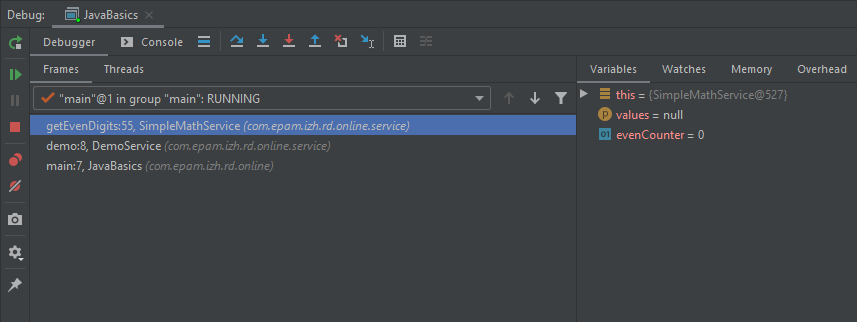
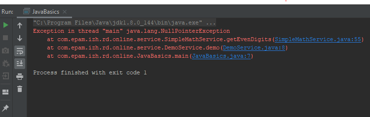
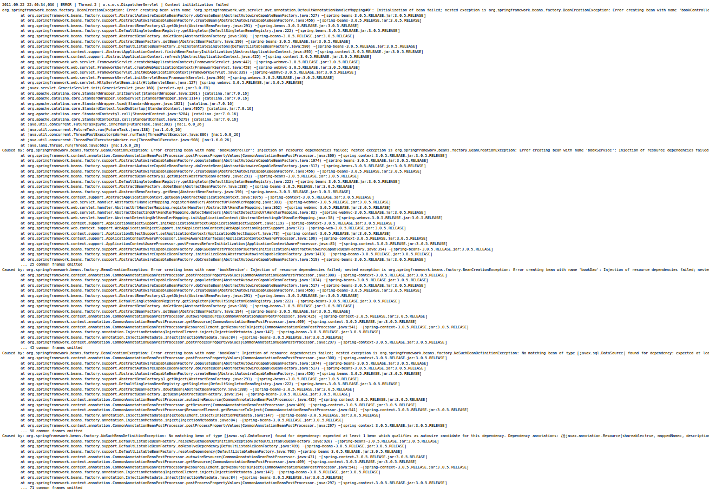
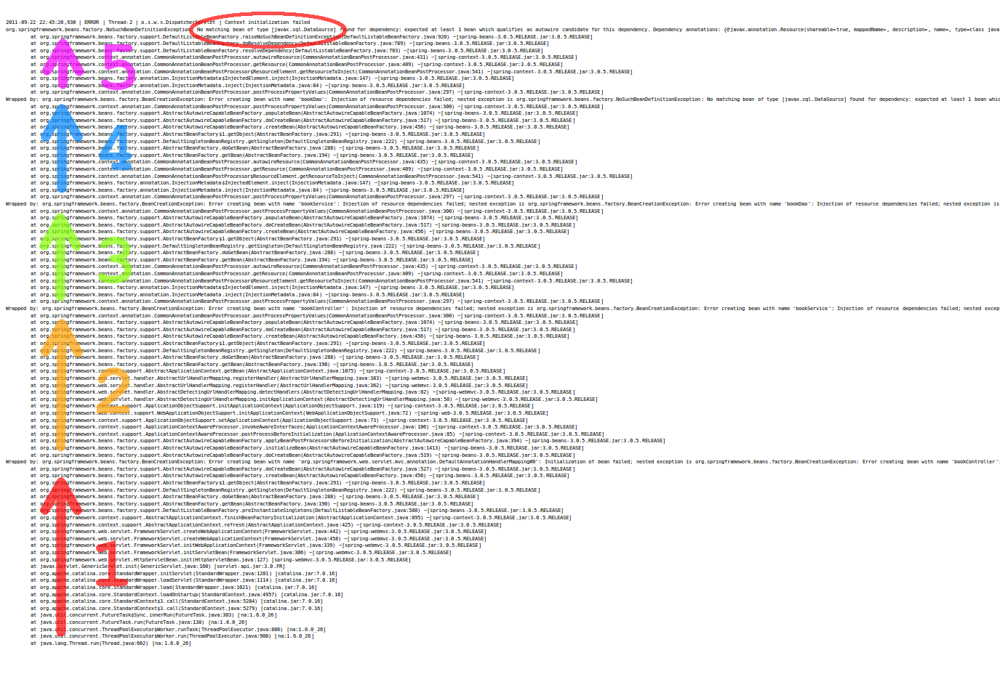



Как работать со стектрейсами в джаве
===

Навык решения проблем - один из наиблоее ценных навыков программиста. Когда вы будете выполнять задания нашего курса, то, скорее
всего, в процессе вашей работы будут возникать те или иные трудности. Одна из часто встречающихся проблем - ~~какого~~
почему это не работает?! К счастью, люди, которые разрабатывают языки программирования или фреймворки к ним, предусмотрели 
все это и придумали такую крутую вещь, как стектрейс (stacktrace).

Если говорить простыми словами это просто путь выполнения вашей программы, сгруппированный по стекам её выполнения. Если вы
не знаете, что такое стек выполнения, то рекомендуем сначала ознакомиться с этой [статьей](https://javarush.ru/quests/lectures/questsyntax.level09.lecture01)

Консольное приложение
---------------------

Вы можете в любой момент посмотреть текущий стек вызовов в любой программе, всего лишь остановившись на брейкпоинте в режиме
дебага, например:

Нас интересует левая часть вкладки дебага. В ней будет показан поток, который дошел до точки остановки (в нашем случае
это `main"@1 in group "main` - то есть основной поток). Чуть ниже будет показан искомый call stack. Он начинается, как и
любая программа в джаве, с мейн-класса `main:7, JavaBasics (com.epam.izh.rd.online)`, далее в этом методе произошел вызов
метода `demo:8, DemoService (com.epam.izh.rd.online.service)`, а затем и `getEvenDigits:55, SimpleMathService (com.epam.izh.rd.online.service)`
То есть элементы call stack'a расположены в порядке, идентичному схеме First In Last Out (как и в настоящем стеке)                                                          

Давайте попробуем воспроизвести самую встречающуюся ошибку начинающих (и не только) программистов - `NullPointerException`
Запустили, смотрим в консоль и видим следующее:

Что же мы можем здесь понять? Самая первая строчка - это просто команда, которой IDE запустила нашу программу, это нам не 
интересно. А вот далее - `Exception in thread "main" java.lang.NullPointerException` - и есть причина ошибки нашей программы.
Но как понять где она реально произошла? В этом нам поможет стектрейс, а именно самый верхний стек, на котором мы находились 
в тот момент времени - `at com.epam.izh.rd.online.service.SimpleMathService.getEvenDigits(SimpleMathService.java:55)`. Видим,
что ошибка возникает в методе `getEvenDigits` класса `SimpleMathService` в строке 55.

Spring-приложение
---------------------
К сожалению, в реальной работе мы почти не пишем консольных программ, а пользуемся фреймворками. Давайте попробуем сделать
ошибку в простом web-приложении (в котором используется Spring Boot) и разобраться, в чем причина.

У нас получился следующий стектрейс (чтобы лучше было видно, можно открыть эту картинку в новой вкладке):

На первый взгляд, ничего не понятно. Но давайте разберем по шагам, что тут написано. Как можно заметить, здесь всего 5 стектрейсов:

Первый (1) стектрейс начинается методом `Thread.run` - это начало того потока, в котором произошла ошибка (дело в том, что обычно веб-приложения)
имеют не единственный поток выполнения. Далее мы видим что выскочил `BeanCreationException` - не удалось создать бин `bookController`.
Но это не причина возникновения этой ошибки, если присмотреться, то в стектрейсах (2) и (3) аналогичное исключение с бинами
`bookService` и `bookDao` - это потому что бин `bookController` зависел от них.
А в стектрейсе (4) другая ошибка - `NoSuchBeanDefinitionException`. Обычно это означает что спринг не нашел дефинишена бина,
а дефолтный бин не был предусмотрен контейнером, но при этом мы ожидаем, что этот бин будет создан.

Ну и наконец в стектрейсе (5) мы видим исходную ошибку. Почему же в итоге стектрейсов получилсь 5? Дело в том, что во всех
серьезных проектах используется техника `ExceptionWrapping-a` подробнее про это можно прочитать [в этой статье](http://tutorials.jenkov.com/java-exception-handling/exception-wrapping.html)
